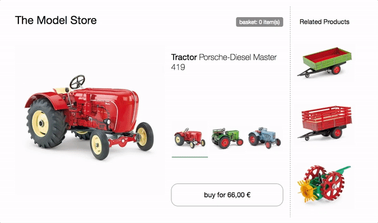
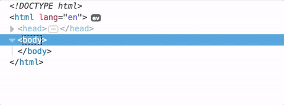
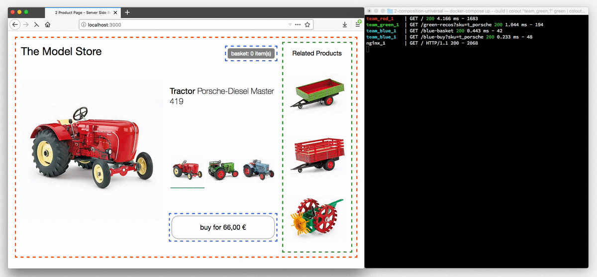
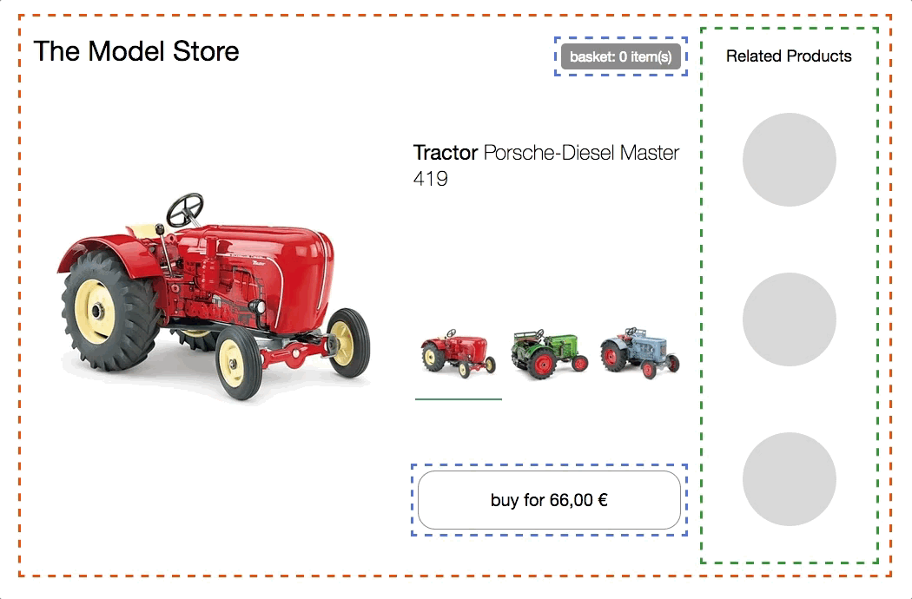

Técnicas, estrategias y recetas para crear una __aplicación web moderna__ con __múltiples equipos__ que pueden __entregar funcionalidades independientemente__.

## ¿Qué son los micro frontend?

El término __Micro Frontends__ apareció por primera vez en [ThoughtWorks Technology Radar](https://www.thoughtworks.com/radar/techniques/micro-frontends) a finales de 2016. Extiende los conceptos de los micro servicios al mundo del frontend. La tendencia actual es crear una aplicación de navegador potente y rica en características, también conocida como "single page app", que se asiente sobre una arquitectura de microservicio. Con el tiempo, la capa de frontend, a menudo desarrollada por un equipo independiente, crece y se vuelve más difícil de mantener. Eso es lo que llamamos una [Interfaz Monolítica](https://www.youtube.com/watch?v=pU1gXA0rfwc).

La idea detrás de Micro Frontends es pensar en un sitio web o aplicación web como __una composición de características__ que son propiedad de __equipos independientes__. Cada equipo tiene un __área de negocio definida__ o __misión__ de la que se preocupa y se especializa. Un equipo es __cross functional__ y desarrolla sus características __end-to-end__, desde la base de datos hasta la interfaz de usuario.

Sin embargo, esta idea no es nueva, en el pasado se llamaba [Integración de Frontend para Sistemas Verticales](https://dev.otto.de/2014/07/29/scaling-with-microservices-and-vertical-decomposition/) o [Sistemas autocontenidos](http://scs-architecture.org/). Pero Micro Frontends es claramente un término más amigable y menos voluminoso.

__Frontends monolíticos__

__Organización vertical__

## ¿Qué es una aplicación web moderna?

En la introducción he usado la frase "crear una aplicación web moderna". Vamos a definir los supuestos que están relacionados con este término.

Para poner esto en una perspectiva más amplia, [Aral Balkan](https://ar.al/) ha escrito una publicación en su blog sobre lo que él llama el [Documents‐to‐Applications Continuum](https://ar.al/notes/the-documents-to-applications-continuum/). Sugiere la idea de una escala móvil en la que un sitio, construido a partir de __documentos estáticos__, conectado a través de enlaces, se encuentra __a la izquierda__ y uno dirigido completamente por comportamiento, una __aplicación sin contenido__, como un editor de fotos en online, está __a la derecha__.

Si tu proyecto se encuentra en el __lado izquierdo de este espectro__, una __integración en servidor web__ es una buena opción. Con este modelo, un servidor recopila y __concatena cadenas de HTML__ de todos los componentes que conforman la página solicitada por el usuario. Las actualizaciones se realizan recargando la página desde el servidor o reemplazando partes de ella a través de ajax. [Gustaf Nilsson Kotte](https://twitter.com/gustaf_nk/) ha escrito un [amplio artículo](https://gustafnk.github.io/microservice-websites/) sobre este tema.

Cuando la interfaz de usuario tiene que proporcionar __información instantánea__, incluso en conexiones no estables, un sitio de servidor puro no es suficiente. Para implementar técnicas como [UI optimista](https://www.smashingmagazine.com/2016/11/true-lies-of-optimistic-user-interfaces/) o [Skeleton Screens](http://www.lukew.com/ff/entry.asp?1797) debe poder también __actualizar__ la UI __en el dispositivo en sí__. El término de Google [Progressive Web Apps](https://developers.google.com/web/progressive-web-apps/) describe adecuadamente el __balanceo__ entre ser un buen ciudadano de la web (mejora progresiva) y al mismo tiempo proporcionar rendimiento como en una app. Este tipo de aplicación se encuentra en algún lugar __sobre la mitad__. Aquí una solución basada únicamente en el servidor ya no es suficiente. Tenemos que movernos a la integración __en el navegador__, y ese es el enfoque de este artículo.

## Ideas centrales detrás de las micro frontend

* __Sé Agnóstico a la Tecnología__ Cada equipo debe poder elegir y actualizar su stack sin tener que coordinar con otros equipos. Los [Custom Elements](#el-dom-es-la-api) son una excelente manera de ocultar los detalles de la implementación mientras se proporciona una interfaz neutral a otros.
* __Aislar el código del equipo__  No compartir tiempo de ejecución, incluso si todos los equipos usan el mismo framework. Crea aplicaciones independientes que sean autónomas. No hay que confiar en estado compartido o variables globales.
* __Establecer prefijos de equipo__ Acordar los espacios de nombres no aislados. Espacio de nombres CSS, eventos, almacenamiento local y cookies para evitar colisiones y dejar clara la propiedad.
* __Favorece las funciones nativas del navegador sobre las API personalizadas__ Utilizar [Eventos de navegador para la comunicación](#comunicación-padre-hijo--modificación-de-dom) en lugar de crear un sistema global PubSub. Si realmente tiene que crear una API de varios equipos, intente que sea lo más simple posible.
* __Construir un sitio resiliente__ Su función debería ser útil, incluso si JavaScript falla o no se ha ejecutado todavía. Utilizar [Universal Rendering](#renderizad-en-servidor--renderizado-universal) y Progressive Enhancement para mejorar el rendimiento percibido.

---

## El DOM es la API

[Custom Elements](https://developers.google.com/web/fundamentals/getting-started/primers/customelements), el aspecto de interoperabilidad de las especificaciones de Web Components, son una buena primitiva para la integración en el navegador. Cada equipo construye su componente __usando la tecnología web de su elección__ y __lo envuelve dentro de un Custom Element__ (por ejemplo, `<order-minicart></order-minicart>`). La especificación DOM de este elemento en particular (nombre de etiqueta, atributos y eventos) actúa como el contrato o API pública para otros equipos. La ventaja es que pueden usar el componente y su funcionalidad sin tener que conocer la implementación. Solo tienen que ser capaces de interactuar con el DOM.

Pero los custom elements por sí solos no son la solución a todas nuestras necesidades. Para abordar la mejora progresiva, renderizado universal o el routing, necesitamos piezas de software adicionales.

Esta página está dividida en dos áreas principales. Primero, analizaremos [Composición de la página](#composición-de-la-página): cómo ensamblar una página con componentes que pertenecen a diferentes equipos. Después mostraremos ejemplos para implementar el lado de cliente [Transición de página](#page-transition).

## Composición de la página

Además de la integración __cliente-servidor__ del código escrito con __diferentes frameworks__, hay muchos temas secundarios que deben ser discutidos: mecanismos para __aislar js__, __evitar conflictos css__, __cargar recursos__ según sea necesario, __compartir recursos comunes__ entre equipos, manejar la __obtención de datos__ y pensar sobre __estados de carga__ buenos para el usuario. Vamos a entrar en estos temas paso a paso.

### El prototipo base

La página de productos de este modelo de tienda de tractores servirá de base para los siguientes ejemplos.

Cuenta con un __selector__ para cambiar entre los tres modelos diferentes de tractores. Al cambiar la imagen del producto, se actualizan el nombre, el precio y las recomendaciones. También hay un __botón comprar__, que añade la variedad seleccionada a la cesta y una __minicesta__ en la parte superior que se actualiza en consecuencia.

[probar en navegador](./0-model-store/) & [inspeccionar código](https://github.com/neuland/micro-frontends/tree/master/0-model-store)

Todo el HTML se genera en el lado del cliente utilizando __JavaScript__ y Template Strings ES6 __sin dependencias__. El código separa estado de maquetacion y vuelve a renderizar todo el lado del cliente HTML en cada cambio, sin DOM extraño ni __renderizado universal__ por ahora. Tampoco __separación por equipo__ - [código] https://github.com/neuland/micro-frontends/tree/master/0-model-store) está escrito en un archivo js/css.

### Integración del lado del cliente

En este ejemplo, la página se divide en componentes/fragmentos separados que pertenecen a tres equipos. __Team Checkout__ (azul) ahora es responsable de todo lo relacionado con el proceso de compra, es decir, __botón de compra__ y __minicesta__. __Team Inspire__ (verde) administra las __recomendaciones de producto__ en esta página. La página en sí es propiedad de __Team Product__ (rojo).

[probar en navegador](./1-composition-client-only/) & [inspeccionar código](https://github.com/neuland/micro-frontends/tree/master/1-composition-client-only)

__El equipo de producto__(rojo) decide qué funcionalidad se incluye y dónde se coloca en el diseño. La página contiene información que puede ser proporcionada por el propio equipo, como el nombre del producto, la imagen y las variedades disponibles. Pero también incluye fragmentos (custom elements) de los otros equipos.

### ¿Cómo crear un Custom Element?

Tomemos el __botón de compra__ como ejemplo. El equipo de producto incluye el botón simplemente agregando `<blue-buy sku="t_porsche"></blue-buy>` en la posición deseada en la maquetación. Para que esto funcione, Team Checkout debe registrar el elemento `blue-buy` en la página.

    class BlueBuy extends HTMLElement {
      constructor() {
        super();
        this.innerHTML = `<button type="button">buy for 66,00 €</button>`;
      }
      disconnectedCallback() { ... }
    }
    window.customElements.define('blue-buy', BlueBuy);

Ahora, cada vez que el navegador encuentra una nueva etiqueta `blue-buy`, se llama al constructor. `this` es la referencia al nodo DOM raíz del Custom Element. Se pueden usar todas las propiedades y métodos de un elemento DOM estándar como `innerHTML` o `getAttribute()`.

Al nombrar tu elemento, el único requisito que define la especificación es que el nombre debe __incluir un guión (-)__ para mantener la compatibilidad con las nuevas etiquetas HTML. En los siguientes ejemplos, se utiliza la convención de nombres `[color]-[característica]`. El espacio de nombres del equipo protege contra las colisiones y, de esta manera, el propietario de una característica se vuelve obvio, simplemente mirando el DOM.

### Comunicación padre-hijo / Modificación de DOM

Cuando el usuario selecciona otro tractor en el __selector__, el __botón comprar debe actualizarse__ en consecuencia. Para lograr el equipo de producto simplemente puede __borrar__ el elemento existente del DOM __e insertar__ uno nuevo.

    container.innerHTML;
    // => <blue-buy sku="t_porsche">...</blue-buy>
    container.innerHTML = '<blue-buy sku="t_fendt"></blue-buy>';

El `disconnectedCallback` del antiguo elemento se invoca de forma sincrónica para proporcionar al elemento la posibilidad de limpiar cosas como los event listeners. Después de eso, se llama al `constructor` del elemento` t_fendt` recién creado.

Otra opción más eficaz es simplemente actualizar el atributo `sku` en el elemento existente.

    document.querySelector('blue-buy').setAttribute('sku', 't_fendt');

Si el equipo de producto usara un motor de plantillas que detecta diferencias de DOM, como React, el algoritmo lo haría automáticamente.

Para respaldar esto, el Custom Element puede implementar `attributeChangedCallback` y especificar una lista de atributos observados en `observedAttributes` para los cuales se debe ejecutar este callback.

    const prices = {
      t_porsche: '66,00 €',
      t_fendt: '54,00 €',
      t_eicher: '58,00 €',
    };

    class BlueBuy extends HTMLElement {
      static get observedAttributes() {
        return ['sku'];
      }
      constructor() {
        super();
        this.render();
      }
      render() {
        const sku = this.getAttribute('sku');
        const price = prices[sku];
        this.innerHTML = `<button type="button">buy for ${price}</button>`;
      }
      attributeChangedCallback(attr, oldValue, newValue) {
        this.render();
      }
      disconnectedCallback() {...}
    }
    window.customElements.define('blue-buy', BlueBuy);

Para evitar la duplicidad, se introduce un método `render()` que se llama desde `constructor` y` attributeChangedCallback`. Este método recopila los datos necesarios y el nuevo html que se asigna a innerHTML. Si se decide ir con un motor de plantillas o un framework más sofisticado dentro del custom element, aquí es donde va la inialización de este.

### Soporte en navegador

El ejemplo anterior utiliza la especificación Custom Element V1 que actualmente está [soportada en Chrome, Safari y Opera](http://caniuse.com/#feat=custom-elementsv1). Pero con [document-register-element](https://github.com/WebReflection/document-register-element) hay disponible un polyfill ligero y probado en la batalla para que  funcione en todos los navegadores. Bajo el capó, utiliza la API de Mutation Observer [ampliamente soportada](http://caniuse.com/#feat=mutationobserver), por lo que no hay operaciones raras en árbol del DOM en segundo plano.

### Framework de Compatibilidad

Debido a que los custom elements son un estándar web, todos los frameworks principales de JavaScript como Angular, React, Preact, Vue o Hyperapp los soportan. Pero cuando entras en detalle, todavía hay algunos problemas de implementación en algunos frameworks. En [Custom Elements Everywhere](https://custom-elements-everywhere.com/) [Rob Dodson](https://twitter.com/rob_dodson) ha reunido un conjunto de pruebas de compatibilidad que destaca los problemas no resueltos.

### Comunicación padre-hijo (o hermanos) / eventos de DOM

Pero pasar atributos no es suficiente para todas las interacciones. En nuestro ejemplo, la __minicesta debe actualizarse__ cuando el usuario hace __click en el botón comprar__.

Ambos fragmentos son propiedad de Team Checkout (azul), por lo que podrían crear algún tipo de API interna de JavaScript que le permita a la mini cesta saber cuándo se presionó el botón. Pero esto requeriría que las instancias de los componentes se conozcan entre sí y también sería una violación de aislamiento.

Una forma más limpia es utilizar un mecanismo PubSub, donde un componente puede publicar un mensaje y otros componentes pueden suscribirse a temas específicos. Por suerte los navegadores tienen esta característica incorporada. Así es exactamente cómo funcionan los eventos del navegador como `click`,` select` o `mouseover`. Además de los eventos nativos, también existe la posibilidad de crear eventos de nivel superior con `new CustomEvent(...)`. Los eventos siempre están vinculados al nodo DOM en el que se crearon/enviaron. La mayoría de los eventos nativos también hacen bubbling. Esto hace posible escuchar todos los eventos en un subárbol específico del DOM. Si desea escuchar todos los eventos de la página, se puede añadir un listener al elemento window. Aquí es cómo se ve la creación del evento `blue:basket:changed` en el ejemplo:

    class BlueBuy extends HTMLElement {
      [...]
      connectedCallback() {
        [...]
        this.render();
        this.firstChild.addEventListener('click', this.addToCart);
      }
      addToCart() {
        // maybe talk to an api
        this.dispatchEvent(new CustomEvent('blue:basket:changed', {
          bubbles: true,
        }));
      }
      render() {
        this.innerHTML = `<button type="button">buy</button>`;
      }
      disconnectedCallback() {
        this.firstChild.removeEventListener('click', this.addToCart);
      }
    }

La mini cesta ahora puede suscribirse a este evento en `window` y recibir una notificación cuando deba actualizar sus datos.

    class BlueBasket extends HTMLElement {
      connectedCallback() {
        [...]
        window.addEventListener('blue:basket:changed', this.refresh);
      }
      refresh() {
        // fetch new data and render it
      }
      disconnectedCallback() {
        window.removeEventListener('blue:basket:changed', this.refresh);
      }
    }

Con este enfoque el fragmento de la mini cesta agrega un oyente a un elemento DOM que está fuera de su alcance (`window`). Esto debería estar bien para muchas aplicaciones, pero si no estas cómodo con esto, también se puede implementar un enfoque en el que la propia página (Team Product) escuche el evento y notifique a la mini cesta llamando a `refresh()` en el elemento DOM.

    // page.js
    const $ = document.getElementsByTagName;

    $('blue-buy')[0].addEventListener('blue:basket:changed', function() {
      $('blue-basket')[0].refresh();
    });

Llamada imperativa a los métodos DOM es bastante poco común, pero se puede encontrar en [video element api](https://developer.mozilla.org/de/docs/Web/HTML/Using_HTML5_audio_and_video#Controlling_media_playback) por ejemplo. Si es posible se debería hacer uso de un enfoque declarativo (cambio de atributo).

## Renderizado en servidor / Renderizado Universal

Los Custom Elements son excelentes para integrar componentes dentro del navegador. Pero cuando se construye un site, es probable que la velocidad de carga inicial sea importante y que los usuarios vean una pantalla en blanco hasta que se descarguen y ejecuten todos los frameworks JS. Además, es bueno pensar qué pasa con el sitio si el JavaScript falla o está bloqueado. [Jeremy Keith](https://adactio.com/) explica la importancia de su libro/podcast [Resilient Web Design](https://resilientwebdesign.com/). Por lo tanto, la capacidad de renderizar el contenido en el servidor es clave. Lamentablemente, la especificación de componentes web no habla en absoluto renderizado en servidor. Sin JavaScript no hay Custom Elements :(

### Custom Elements + Server Side Includes = ❤️

Para hacer que el renderizado del servidor funcione hay que refactorizar el ejemplo anterior. Cada equipo tiene su propio servidor Express y el método `render()` del elemento personalizado también es accesible a través de url.

    $ curl http://127.0.0.1:3000/blue-buy?sku=t_porsche
    <button type="button">buy for 66,00 €</button>

El nombre de la etiqueta del Custom Element se utiliza como nombre de la ruta: los atributos se convierten en query params. Ahora hay una manera de procesar en servidor el contenido de cada componente. Combinado con custom element `<blue-buy>` se consigue algo que está bastante cerca de un __Universal Web Component__:

    <blue-buy sku="t_porsche">
      <!--#include virtual="/blue-buy?sku=t_porsche" -->
    </blue-buy>

El comentario `#include` es parte de [Server Side Includes](https://en.wikipedia.org/wiki/Server_Side_Includes), que es una característica que está disponible en la mayoría de los servidores web. Sí, es la misma técnica usada hace tiempo para insertar la fecha actual en nuestros sitios web. También hay algunas técnicas alternativas como [ESI](https://en.wikipedia.org/wiki/Edge_Side_Includes), [nodesi](https://github.com/Schibsted-Tech-Polska/nodesi), [compoxure](https://github.com/tes/compoxure) y [tailor](https://github.com/zalando/tailor), pero en general Server Side Iincludes (SSI) ha demostrado ser una solución simple e increíblemente estable.

El comentario `#include` se reemplaza con la respuesta de `/blue-buy?sku=t_porsche` antes de que el servidor web envíe la página completa al navegador. La configuración en nginx sería así:

    upstream team_blue {
      server team_blue:3001;
    }
    upstream team_green {
      server team_green:3002;
    }
    upstream team_red {
      server team_red:3003;
    }

    server {
      listen 3000;
      ssi on;

      location /blue {
        proxy_pass  http://team_blue;
      }
      location /green {
        proxy_pass  http://team_green;
      }
      location /red {
        proxy_pass  http://team_red;
      }
      location / {
        proxy_pass  http://team_red;
      }
    }

La directiva `ssi: on;` habilita la función SSI y añadimos un bloque `upstream` y `location` para cada equipo para garantizar que todas las direcciones URL que comienzan con `/blue` se dirijan a la aplicación correcta (`team_blue: 3001`). Además, la ruta `/` se asigna al equipo rojo, que controla la página de inicio / página de producto.

Esta animación muestra la tienda de tractores en un navegador que tiene __JavaScript desactivado__.

[ver el código](https://github.com/neuland/micro-frontends/tree/master/2-composition-universal)

Los botones de selección ahora son enlaces reales y cada click produce una recarga de la página. El terminal a la derecha ilustra el proceso de cómo una solicitud de una página se enruta al equipo rojo, que controla la página de producto y luego el marcado se complementa con los fragmentos del equipo azul y verde.

Al volver a activar JavaScript, solo estarán visibles los mensajes llamadas al servidor para la primera solicitud. Todos los cambios posteriores se manejan del lado del cliente, como en el primer ejemplo. En un ejemplo posterior, los datos del producto se extraerán del JavaScript y se cargarán a través de una API REST según sea necesario.

Puedes jugar con este código de muestra en tu máquina local. Solo se debe instalar [Docker Compose](https://docs.docker.com/compose/install/).

    git clone https://github.com/neuland/micro-frontends.git
    cd micro-frontends/2-composition-universal
    docker-compose up --build

Docker luego inicia el nginx en el puerto 3000 y construye la imagen node.js para cada equipo. Cuando se abra [http://127.0.0.1:3000/](http://127.0.0.1:3000/) en el navegador se debe de ver un tractor rojo. El log combinado de `docker-compose` hace que sea fácil ver lo que está sucediendo en la red. Lamentablemente, no hay forma de controlar el color de salida, por lo que el equipo azul se resaltará en verde :)

Los archivos `src` se mapean a contenedores individuales y la aplicación node se reinicia cuando realiza un cambio de código. Cambiar el `nginx.conf` requiere un reinicio de `docker-compose` para que tenga efecto. Así que no dudes en juguetear y dar tu opinión.

### Carga de datos y Estados carga

Una desventaja del enfoque SSI/ESI es que el fragmento __más lento determina el tiempo de respuesta__ de toda la página.
Así que es bueno almacenar los framentos en caché.
Para los fragmentos que son costosos de producir y difíciles de almacenar en caché, a menudo es buena idea excluirlos del procesamiento inicial.
Se pueden cargar de forma asíncrona en el navegador.
En nuestro ejemplo, el fragmento `green-recos`, que muestra recomendaciones personalizadas, es un candidato para esto.

Una posible solución sería que el equipo rojo solo omita el SSI Include.

**Antes**

    <green-recos sku="t_porsche">
      <!--#include virtual="/green-recos?sku=t_porsche" -->
    </green-recos>

**Después**

    <green-recos sku="t_porsche"></green-recos>

*Nota importante: Custom Elements [no puede cerrarse en un solo tag](https://developers.google.com/web/fundamentals/architecture/building-components/customelements#jsapi), por lo que `<green-recos sku="t_porsche" />` no funciona correctamente.*

El renderizado solo tiene lugar en el navegador.
Pero, como se puede ver en la animación, este cambio ahora ha introducido un __reflow importante__ de la página.
El área de recomendación está inicialmente en blanco.
El JavaScript del equipo verde está cargado y ejecutado.
Se hace la llamada al API para obtener la recomendación personalizada.
El HTML de la recomendación se renderiza y se solicitan las imágenes asociadas.
El fragmento ahora necesita más espacio y empuja el diseño de la página.

Hay diferentes opciones para evitar un reflow molesto como éste.
El equipo rojo, que controla la página, podría __fijar la altura de los contenedores de recomendación__.
En un sitio web responsive a menudo es difícil determinar la altura, ya que podría diferir para diferentes tamaños de pantalla.
Pero el problema más importante es que __este tipo de acuerdo entre equipos crea un fuerte acoplamiento__ entre el equipo rojo y verde.
Si el equipo verde quiere introducir un subtítulo adicional en el elemento reco, tendría que coordinar con el equipo rojo en la nueva altura.
Ambos equipos tendrían que implementar sus cambios simultáneamente para evitar romper diseño.

Una mejor manera es usar una técnica llamada [Skeleton Screens](https://blog.prototypr.io/luke-wroblewski-introduced-skeleton-screens-in-2013-through-his-work-on-the-polar-app-later-fd1d32a6a8e7).
El equipo rojo deja el `green-recos` SSI Include en la maquetación.
Además, el equipo verde cambia el __método de render en el servidor__ de su fragmento para que produzca una __versión esquemática del contenido__.
El __skeleton markup__ puede reutilizar partes de los estilos de diseño del contenido real.
De esta manera, __reserva el espacio necesario__ y el relleno del contenido real no produce salto.

Los __skeleton__ también son __muy útiles para la representación del cliente__.
Cuando un custom element se inserta en el DOM por una acción del usuario, puede __instantáneamente representar skeleton__ hasta que lleguen los datos que necesita del servidor.

Incluso en un __cambio de atributo__ como _variant select_ se puede decidir mostrar el skeleton hasta que lleguen los nuevos datos.
De esta manera, el usuario percibe que algo está sucediendo en el fragmento.
Pero cuando el endpoint responde rápidamente, un breve __skeleton flicker__ entre los datos antiguos y nuevos también podría ser molesto.
Preservar los datos antiguos o usar timeouts inteligentes puede ayudar.
Utiliza esta técnica con cuidado y recoger feedback de los usuarios.

## Navegando entre páginas

__Continuará ...__

Puede ver el [Repo en Github](https://github.com/neuland/micro-frontends) para más información.

## Recursos adicionales
- [Charla: Micro Frontends - Web Rebels, Oslo 2018](https://www.youtube.com/watch?v=dTW7eJsIHDg) ([Slides](https://noti.st/naltatis/HxcUfZ/micro-frontends-think-smaller-avoid-the-monolith-love-the-backend))
- [Slides: Micro Frontends - JSUnconf.eu 2017](https://speakerdeck.com/naltatis/micro-frontends-building-a-modern-webapp-with-multiple-teams)
- [Charla: Break Up With Your Frontend Monolith - JS Kongress 2017](https://www.youtube.com/watch?v=W3_8sxUurzA) Elisabeth Engel habla sobre implementacion de Micro Frontends en gutefrage.net
- [Post: Micro frontends - a microservice approach to front-end web development](https://medium.com/@tomsoderlund/micro-frontends-a-microservice-approach-to-front-end-web-development-f325ebdadc16) Tom Söderlund explica el concepto y provee enlaces sobre este tema.
- [Post: Microservices to Micro-Frontends](http://www.agilechamps.com/microservices-to-micro-frontends/) Sandeep Jain resume los pricipios clave detrás de los microservicios y micro frontends
- [Link Collection: Micro Frontends by Elisabeth Engel](https://micro-frontends.zeef.com/elisabeth.engel?ref=elisabeth.engel&share=ee53d51a914b4951ae5c94ece97642fc) extensa lista de posts, charlas, herramientas y otros recursos sobre este tema.
- [Awesome Micro Frontends](https://github.com/ChristianUlbrich/awesome-microfrontends) una lista filtrada de enlaces por Christian Ulbrich 🕶
- [Custom Elements Everywhere](https://custom-elements-everywhere.com/) Comprueba cómo frameworks y custom elements pueden ser amigos.
- Los tractores se pueden comprar en [manufactum.com](https://www.manufactum.com/) :) _Esta tienda está desarrollada por dos equipos usando las técnicas aquí descritas._

## Técnicas relacionadas
- [Posts: Cookie Cutter Scaling](https://paulhammant.com/categories.html#Cookie_Cutter_Scaling) David Hammet escribe una serie de artículos en blog sobre este tema.
- [Wikipedia: Java Portlet Specification](https://en.wikipedia.org/wiki/Java_Portlet_Specification) Especificación que trata temas similares para crear portales empresariales.

---

## Cosas por venir ...

- Casos de uso
  - Navegación entre páginas
    - Navegación suave vs navegación dura
    - Router universal
  - ...
- Temas secundarios
  - CSS aislado / Interfaz de usuario coherente / Guías de estilo y bibliotecas de patrones
  - Rendimiento en carga inicial
  - Rendimiento durante el uso del sitio
  - Carga de CSS
  - Carga de JS
  - Tests de integración
  - ...

## Autor
**Michael Geers** ([@naltatis](https://twitter.com/naltatis)) es ingeniero de software en [neuland Büro für Informatik](https://www.neuland-bfi.de/) y trabaja en la construcción de frontends agradables para e-commerce.

## Colaboradores
- [Jorge Beltrán](https://github.com/scipion) colaborador traducción y correcciones a [Español](https://micro-frontends-es.org).
- [Koike Takayuki](https://github.com/koiketakayuki) quien tradujo el sitio a [Japonés](https://micro-frontends-japanese.org/).

Este sitio es generado por Github Pages. Su fuente se puede encontrar en español en [scipion/micro-frontends](https://github.com/scipion/micro-frontends/), o en el sitio original en [neuland/micro-frontends](https://github.com/neuland/micro-frontends/).
